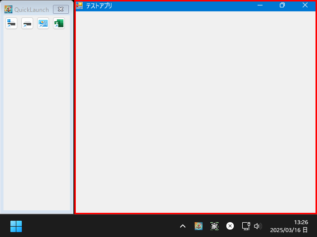
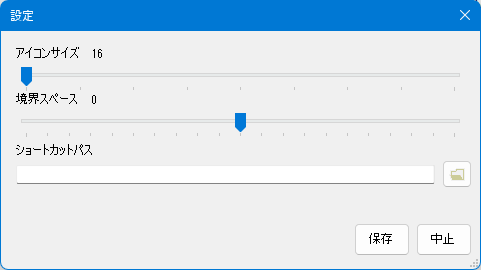
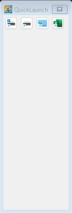

# QuickLaunch

このソフトは、Windows10のQuickLaunch風のランチャーアプリです。  

## アプリの特徴

このアプリの最大の特徴は、ランチャーの表示領域外がwindowsのクライアントの最大化領域になる事です。

分かりにくいかもしれませんので図解します。  
アプリ起動中は、下図の赤枠部分が通常アプリを最大化すると使用される領域となります。




## 使い方

1. アプリを開始する（初回）
	設定画面が表示されるので設定を行う
	|設定項目名|設定内容|
	|-|-|
	|アイコンサイズ|ランチャー上で表示するアイコンサイズ(24前後がお勧め)|
	|境界スペース|ランチャーの右側のマージンを指定(0推奨)|
	|ショートカットパス|アプリのリンクフォルダを指定する(※後述)|

	

	開始： 保存後アプリが開始されます。  
	中止： アプリを終了します。  

2. アプリを開始する(２回目以降)

	

3. 表示されたアイコンをクリックする


## ショートカットパスで指定するアプリのリンクフォルダについて

アプリのリンクフォルダは、ランチャーで表示したいアプリのリンク（ショートカット）の一覧フォルダの事です。
例えば、C:\ShortCutというフォルダを作成して、そこにランチャーに表示したいアプリのリンクを保存しておきます。

例：
```
C:\ShortCut\
  C.lnk (Cドライブのリンク)
  D.lnk (Dドライブのリンク)
  VSCode.lnk (VisualStudioのリンク)
```

この状態で起動するとランチャーは、３つのアイコンが表示されアイコンをクリックすると、そのリンク先のアプリが起動されます。

